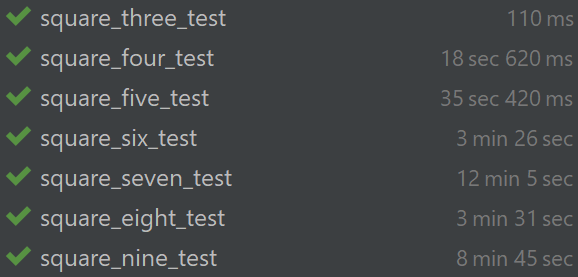

# Evolutionary Algorithm: Solving a magic square

This is an implementation of an evolutionary algorithm in C++ for solving magic squares of sizes between three and nine.
The program generates a population of random candidate solutions and evolves them over multiple generations using selection, crossover, and mutation.
The fitness of each candidate is evaluated based on how closely it matches the constraints of a magic square.

## Usage

To run the program, generate the make files using cmake and compile with your C++ compiler of choice.
Then run the resulting executable. The size of the magic square can be passed as a command-line argument. For example:

```bash
$ cmake .
$ make
$ ./bin/PerfectMagicSquare -d 3 -p 1000 -i 1000
```

This will solve a 3x3 magic square and output the solution to the console.

Following command can be used to run tests and generate squares of sizes between 3 and 9:

```bash
$ ctest
```

## Implementation Details

The program uses a `MagicSquare` class to represent a candidate solution to the magic square problem. The `MagicSquare` class contains a 2D array of integers to store the values of the magic square and a `fitness` value to represent how well it matches the constraints of a magic square.

The main loop of the program repeatedly evaluates the fitness of the population, selects the best candidates,
performs crossover and mutation to generate offspring,
and replaces candidates with the offspring. To make the algorithm more efficient additional new candidates are added to the population.
An elimination of duplicates is permanently happening in the process.
The program terminates when a solution with a fitness of 0 (i.e., a perfect magic square) is found or after a maximum number of iterations is reached.

## Limitations

The program uses a simple crossover strategy, which may not be the most effective for solving magic squares.
Other selection and crossover strategies could be investigated to improve the algorithm's performance.

The program may not find a solution to larger magic squares within a reasonable amount of time or memory.
Additional optimizations or heuristics may be needed to solve larger magic squares efficiently.

## Test results

Running all tests with the given parameters:



### Resulting squares

3x3 Square:
```bash
| 2| 3| 1|
| 7| 8| 9|
| 6| 4| 5|
```

4x4 Square:
```bash
|10| 9| 6|16|
| 7| 8|11| 1|
|15| 5| 3| 4|
| 2|12|14|13|
```

5x5 Square:
```bash
| 1|14| 2| 3| 8|
|13| 5|22|10| 6|
|19|12|21|23|24|
|15| 9|16|18| 7|
|17|25| 4|11|20|
```

6x6 Square:
```bash
| 7|18|13| 6|36|31|
|11|25|12|32|15|21|
|20|14|35| 9| 4|19|
|22| 3| 1|26|29|30|
|23|27|16|33|10| 2|
|28|24|34| 5|17| 8|
```

7x7 Square:
```bash
|12| 1|49| 3|39|26|11|
|25|45|15|38|13|35|17|
|21|22|29|37|10|42|44|
|14|43|24|36|32| 7|47|
|27|41|19| 9|31|40| 8|
|30|18|33|48|16| 2|28|
|46| 5| 6| 4|34|23|20|
```

8x8 Square:
```bash
|54| 7|24|50|23| 2|51|49|
| 6|26|22|15|45| 3|46|42|
|37| 8|25|56|61|10| 4|14|
|63|40|60|35|30|64|32|18|
| 5|57|59|29|38|47|55|58|
|20|36|13|62| 9|33|27|39|
|44|52|41|12|11|53|28|19|
|31|34|16| 1|43|48|17|21|

```

9x9 Square:
```bash
|36|25|44|22|31|24|65|67|52|
|23|33| 7|43|72|47|77|70| 9|
|69|45|35|75| 6|34|13|15| 4|
|40|48|39|78|21|37|61|28|58|
|17|68|79|27|50|53| 3|56|74|
|73| 5|59|14|81|32| 2|46|62|
|54|26|29| 1|16|19|76|66|51|
| 8|55|57|71|12|63|42|11|41|
|49|64|20|38|80|60|30|10|18|
```